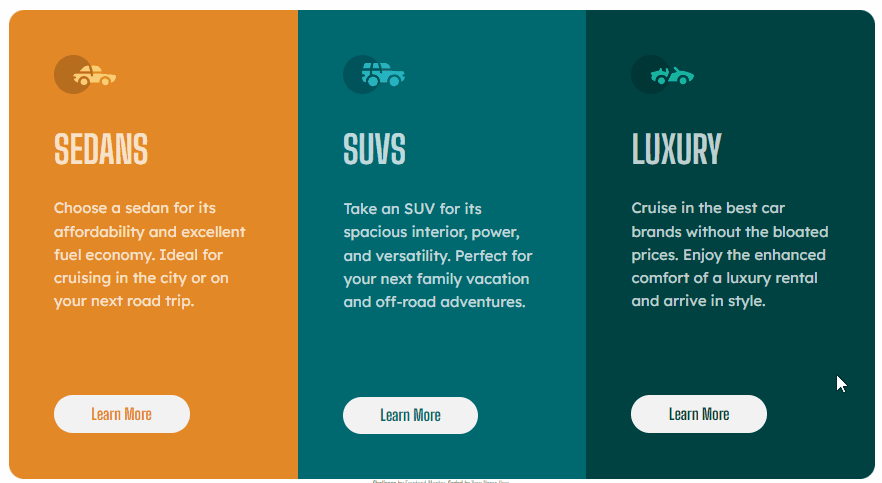
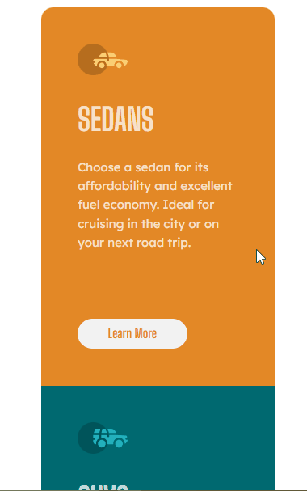

# Frontend Mentor - 3-column preview card component solution

Esta é uma solução para o [Desafio do componente do cartão de visualização de 3 colunas no Frontend Mentor](https://www.frontendmentor.io/challenges/recipe-page-KiTsR8QQKm). Os desafios do Frontend Mentor ajudam você a melhorar suas habilidades de codificação construindo projetos realistas.

### Screenshot

[]

[]

### Link

- URL do site ativo: [link aqui](https://andersonf-dev.github.io/3-column-preview-card-component/)

### Criado com

- Marcação HTML5 semântica
- Propriedades personalizadas CSS

### O que aprendi

Aprendi a criar uma card, posicionar elementos na tela centralizar

### Desenvolvimento contínuo

Este é apenas o decimo de muitos dos projetos de front end que fiz. Continuarei fazendo e me desenvolvendo ainda mais. Estou aprendendo cada dia mais, fazendo esses desafios, 
